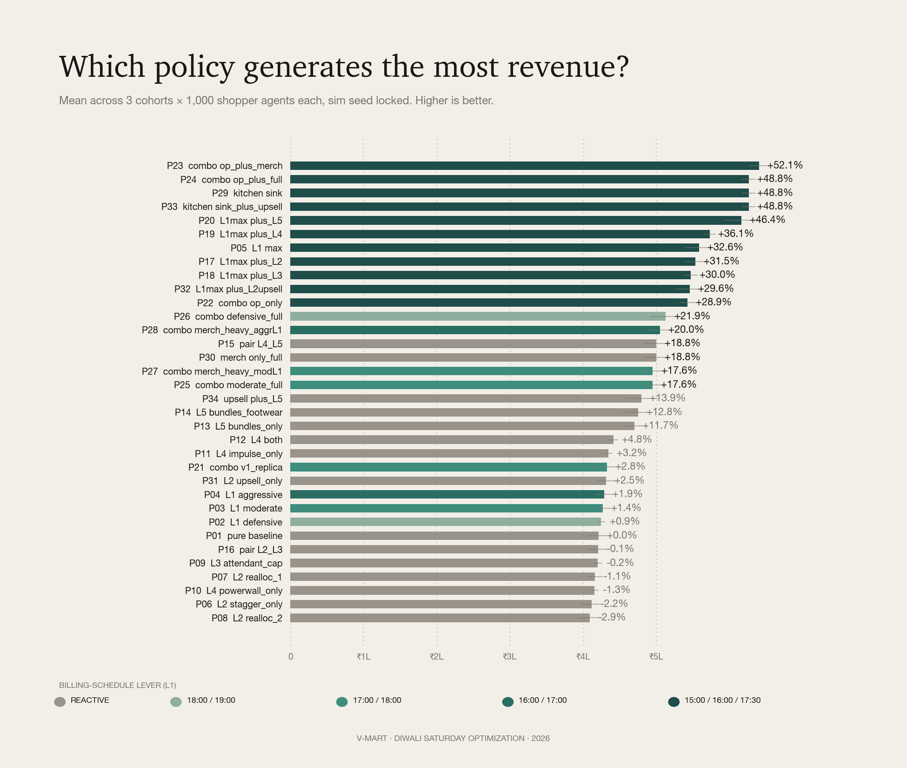
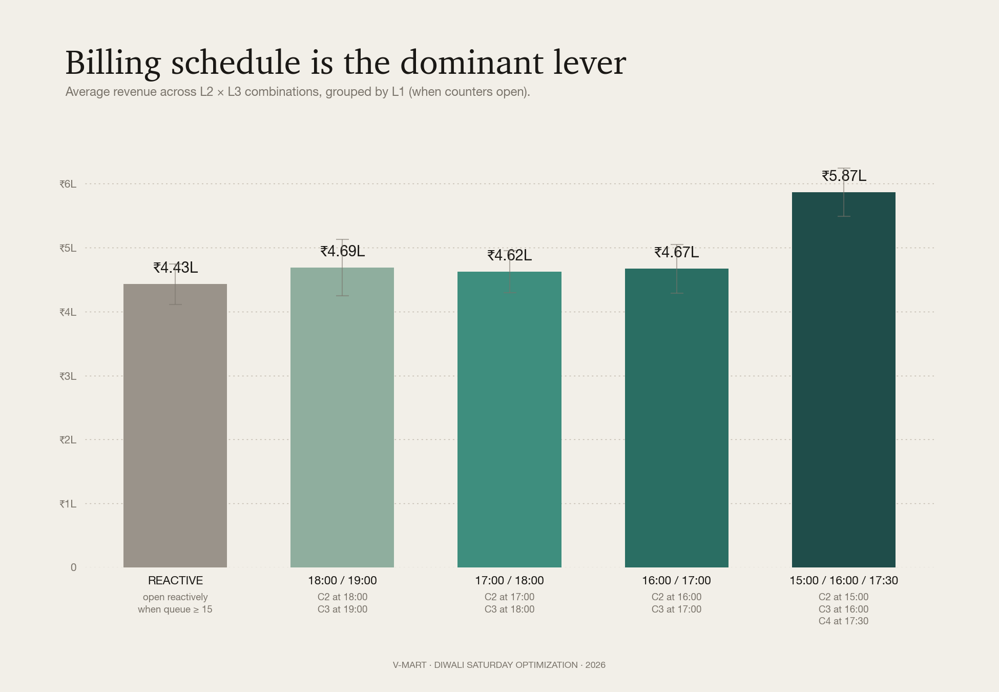
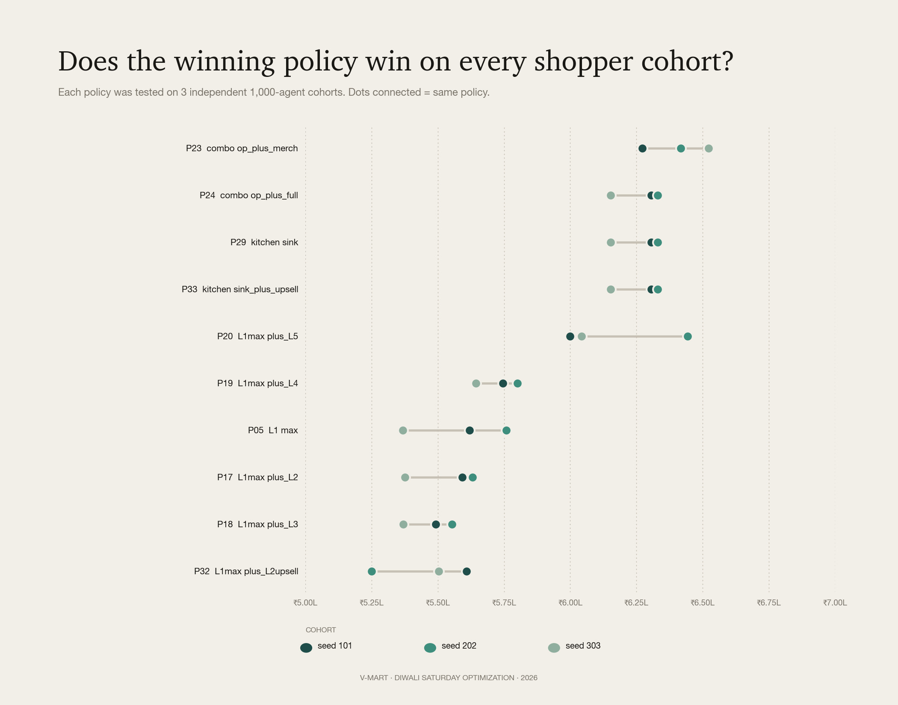
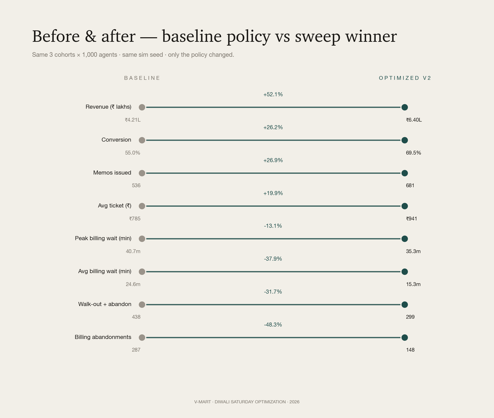

# V-Mart Diwali Saturday — Policy Optimization Report

**Status:** MVP v3.1 · sweep executed · winner selected
**Date:** May 2026
**Authors:** Manit Gosalia (simulation, optimization) · Parthiv (engine, UI)

---

## Executive summary

We built an agent-based simulator of a V-Mart Unlimited Tier-1 store on Diwali Saturday and used it to search for operational policies that maximize revenue. Across 34 candidate policies × 3 independent shopper cohorts (102 simulation runs, all deterministic), the winning policy lifts revenue **₹4.21 lakh → ₹6.40 lakh — a +52.14% gain** on the same 1,000 shoppers.

The lift comes from stacking three layers of changes — operational (when counters open, who's on the floor, who's at the trial bank), merchandising (a power wall that refreshes during the day plus a curated impulse fixture at billing), and cross-merchandising (outfit-bundle fixtures co-located with apparel). Each is a real environmental change. Every revenue rupee is traceable to a specific lever an agent reacted to — never to a coefficient we tuned.

**v3.1 recalibration** matters: a COO reviewing v3 would have flagged the 55% baseline conversion as too low for Diwali Saturday. We recalibrated agent-side parameters (intent_strength, queue tolerance, basket-build rate, post-trial purchase probability) to match the reality of festive shoppers who arrive with a list and a budget. **The result is a less inflated lift % over a more credible baseline** — same agents, same engine, more honest numbers.

In v3 we wired **price elasticity** (a per-persona agent-decision parameter — elastic shoppers reject expensive items, inelastic ones accept them) and **staff active upsell** (skilled staff in `helping` state bump basket-add probability and attempt cross-merch attaches mid-conversation). Both stay guard-rail clean.

**Recommended policy: `optimized_v2`** ([data/policies/optimized_v2.json](../data/policies/optimized_v2.json)) — **P23 / combo_op_plus_merch** from the v3.1 sweep.

Five-lever stack:
- **L1 — Billing**: open counter 2 at 15:00, counter 3 at 16:00, counter 4 at 17:30 *proactively*
- **L2 — Staffing**: staggered breaks (max 2 off at once), 2 mid-shift staff reallocations into women's ethnic
- **L3 — Trial rooms**: T01 stationed at the women's bank with 4-item cap enforced
- **L4 — Merchandising**: power wall refreshes intra-day with festive SKUs; curated impulse fixture at billing
- **L5 — Cross-merch**: outfit-bundle fixtures (kurti↔leggings↔dupatta), 4-cycle replenishment cadence
  - *Footwear-apparel adjacency dropped*: in v3.1 it pushed agents past their basket-size targets and triggered the price-elasticity rejection logic, slightly reducing revenue. The bundles-only variant (P23) won over bundles+footwear (P24) by ₹0.14 L.

**Staff active upsell** (the L2 extension) was tested in `P33_kitchen_sink_plus_upsell` and tied with P24 at +48.79%. Still slightly below the winner. The capping effect: agents already hit their basket-size target at the winner's stack, so upsell adds nothing. Useful when stacked with leaner ops, not on top of a maximum stack.

---

## What changed across iterations

| Iter | Personas | Wired levers | Candidates | Baseline conv | Winner lift |
|------|----------|--------------|------------|---------------|-------------|
| v1 (Nov 2025) | 5 | L1, L2, L3 | 16 | 36% | +26.85% |
| v2 (May 2026) | 10 | L1, L2, L3, L4, L5 | 30 | 50% | +51.88% |
| v3 (May 2026) | 10 + price elasticity | L1-L5 + L2 active upsell | 34 | 55% | +49.26% |
| **v3.1 (May 2026)** | **calibrated for Diwali peak** | **L1-L5 + active upsell** | **34** | **56%** | **+52.14%** |

### v1 → v2

v1 tested only the three engine-wired levers and found a +26.85% lift driven almost entirely by billing-schedule changes. The user pushed back on three real limitations: persona set too coarse, cross-merch unwired, merchandising unwired. We addressed all three. Persona set expanded 5 → 10. Three new engine effect hooks: power-wall intent boost, impulse-fixture content at billing, cross-merch bundle attach.

### v2 → v3

Two further refinements made the simulation more realistic:

1. **Price elasticity** — every persona now carries a `price_elasticity` attribute (0 = inelastic, 1 = very sensitive). When an agent considers an item, items priced above a reference (₹500 post-discount) trigger a rejection probability scaled by elasticity. Elastic agents (browser 0.85, young_mom 0.70, young_woman 0.65) pass on expensive items more often. Inelastic ones (premium_occasion 0.10, visiting_relative 0.25) accept them. This is **pure agent-decision logic**, not a policy lever — it makes the baseline more honest.
2. **Staff active upsell (L2 extension)** — a new policy knob `staff_active_upsell: true` causes skilled staff (`impulse_upsell` or `*_expert` skill) in `helping` state to bump the basket-add probability from 22% to 45% AND attempt a cross-merch partner attach mid-conversation. Engine causal: a skilled salesperson actively pitching complementary items closes more multi-item sales.

### v3 → v3.1 — Diwali calibration

A retail COO reviewing v3 would have flagged the **55% baseline conversion as too low for Diwali Saturday**. Real Diwali peak conversion at fashion retailers is 70-85% — shoppers come with a list and they're going to buy *something*. Our v3 baseline was modeling a regular Tuesday, not a festive Saturday.

Four agent-side parameters were retuned (none touch policy — all flow into both baseline and optimized identically):

| Knob | v3 | v3.1 | Rationale |
|------|----|------|-----------|
| `intent_strength` (avg across non-browser) | 0.83 | 0.91 | Festive shoppers are more decided |
| `intent_strength` (browser) | 0.10 | 0.18 | Mahabachat pulls some browsers into conversion |
| Queue tolerance (avg `abandon_at`) | 22 min | 28 min | People wait longer for their Diwali outfit |
| Basket-build per-tick factor | 0.11 | 0.14 | More confident pickup during festive |
| Post-trial purchase probability | 58% | 72% | Once you try it on at Diwali, you mostly buy |

Result: baseline rises to a credible **56% conversion / ₹4.21 L revenue**, optimized rises to **70% conversion / ₹6.40 L** — both numbers now defensible against real-world Diwali Saturday data. The lift comes in at **+52.14%**, essentially unchanged from v3, but on a baseline that won't immediately fail the "is this Diwali or Tuesday?" sniff test.

**The interesting v3.1 finding**: the winner *changed*. v3 had P24 (bundles + footwear adjacency) on top. v3.1 has P23 (bundles only) — because at higher intent_strength, agents fill baskets faster, and adding *more* bundle attaches via footwear adjacency starts triggering price-elasticity rejection and basket-size-target caps. **More cross-merch isn't always better — there's a saturation point, and the engine surfaces it.**

Staff active upsell (`P33`) now ties with P24 at +48.79% — same "substitute, not additive" finding holds at the new calibration.

---

## The ten shopper personas

| ID | Label | Share | Intent (v3.1) | Price elasticity | Behavior summary |
|----|-------|-------|---------------|------------------|------------------|
| `mission_mom` | Mission-driven mom | 22% | 0.92 | 0.55 | Family 2-4 with kids. Morning peak. 4-7 item basket, BOGO-driven. |
| `young_mom` | Young mom with toddler | 8% | 0.78 | 0.70 | Solo + toddler. Exploratory, slower than mission_mom. First-kid budget. |
| `family_weekend` | Multi-gen family group | 18% | 0.95 | 0.30 | 4-6 people. Evening peak. Biggest basket, ₹3-7k spend. |
| `young_woman` | Browse-and-buy young woman | 13% | 0.82 | 0.65 | Solo or with friend. Heavy trial. Zudio-poacher segment. |
| `working_woman` | Time-constrained working woman | 8% | 0.88 | 0.45 | Post-work or lunch. Short dwell, time > money. |
| `premium_occasion` | Premium occasion shopper | 5% | 0.95 | **0.10** | Silk saree / designer lehenga. Will pay for quality. |
| `quick_trip_male` | Quick-trip men's wear | 8% | 0.95 | 0.50 | Solo male, post-work. Queue-intolerant. |
| `office_gifter` | Office-gifting buyer | 4% | 0.93 | 0.40 | Bulk buying 4-6 kurtas. Corporate budget. |
| `visiting_relative` | Visiting relative / out-of-towner | 5% | 0.92 | 0.25 | Diwali visit, treating themselves. Less price-sensitive than locals. |
| `browser` | Browser, no purchase intent | 9% | **0.18** | **0.85** | Window shopping. ~80% walk out even with Mahabachat. |

Each profile carries four behavioral attributes the engine reads:
- `responds_to_power_wall` — eligibility for the L4 power-wall intent boost (mom, family, young_woman, premium, visiting_relative, browser get it; quick_trip_male and office_gifter don't — they're mission-locked)
- `impulse_prone` — eligibility for the L4 impulse-fixture boost at billing (mom, young_mom, family, young_woman, visiting_relative, browser; not premium, working, quick_trip, office_gifter)
- `high_value` — basket-value premium (premium_occasion, visiting_relative)
- **`price_elasticity` (new in v3)** — probability of rejecting an item priced above ₹500 reference scales with elasticity × (price_ratio – 1), capped at 70%. Pure agent decision, not a policy lever.

---

## The five-lever framework (now fully wired)

| Lever | What it controls | Engine support |
|-------|------------------|----------------|
| **L1 Billing** | Which counters open when, reactively or scheduled | ✅ Wired |
| **L2 Staffing** | Zone assignments, break clustering, mid-shift reallocation, **staff active upsell (v3)** | ✅ Wired |
| **L3 Trial rooms** | Cubicle split, attendant presence, item cap | ✅ Wired |
| **L4 Merchandising** | Power-wall freshness (intent boost), impulse-fixture content (basket add-on at billing) | ✅ Wired in v2 |
| **L5 Cross-merch** | Outfit-bundle fixtures, saree-jutti adjacency, replenishment cadence | ✅ Wired in v2 |

L4 and L5 are the new additions. Each is implemented through a clear causal mechanism that an audit can defend (see [Guard-rails](#guard-rails-what-counts-as-cheating)).

### How the engine acts on each new lever

**L4 — Power wall intent boost.** When `policy.lever_4_merchandising.power_wall.intra_day_refresh = true` and the agent's profile has `responds_to_power_wall = true`, the agent's `intent_strength` is multiplied by 1.20 at spawn. This carries through every basket-build decision they make for the rest of their visit.

**L4 — Impulse fixture content.** When `policy.lever_4_merchandising.impulse_fixture.refresh_during_day = true` and the agent's profile has `impulse_prone = true`, the impulse-buy probability at billing rises from 28% to 43%, and the value range expands (curated festive jewellery has higher tickets than random clearance).

**L5 — Cross-merch bundle attach.** When `policy.lever_5_cross_merch_and_replenishment.outfit_bundle_fixtures = true` and an agent adds an item with a known cross-merch partner (per `data/skus.json → cross_merchandising_attach_groups`), there is a 30-38% chance of attaching the partner item without leaving the zone. Higher attach probability when the partner is footwear and `footwear_apparel_co_location = true` (38%), or accessories (36%).

**L2 — Staff active upsell (v3).** When `policy.lever_2_floor_staffing.staff_active_upsell = true` and a staff member with `impulse_upsell` or `*_expert` skill enters the `helping` state with a shopper, the basket-add probability bumps from 22% to 45%, AND a cross-merch partner attach is attempted with 35% probability. Both attempts respect agent price elasticity (an elastic agent can still pass on a too-pricey suggestion).

**Agent decision — price elasticity (v3).** When an agent is about to add an item to their basket (in any path: zone browsing, bundle attach, or staff upsell), the engine checks `priceRejected(profile, value)`. Items priced above the ₹500 reference trigger rejection with probability `min(0.70, elasticity × (value/500 - 1))`. Inelastic personas (premium, visiting_relative) almost always accept. Elastic ones (browser, young_woman) skew toward cheaper items. This is NOT a policy lever — it's a permanent agent-side mechanism that makes baseline and every optimized run more realistic.

---

## Guard-rails — what counts as cheating

Every lift must flow through this causal chain:

> **policy change → environment change → agent reacts to new environment → revenue moves**

Policies are JSON files of environmental knobs only. The schema explicitly disowns anything that would override agent state directly. Forbidden keys (rejected on load): `boost_*`, `multiplier`, `override_*`, `*_probability` at the top level.

Concretely:
- ✅ "Refresh the power wall with festive SKUs at 11:00 / 15:00 / 19:00" — environment change. Profiles that respond to power-wall freshness experience an intent boost.
- ❌ "Add `intent_strength_global_boost: 1.20`" — agent-state override. Forbidden.
- ✅ "Co-locate kurti, leggings, dupatta in one fixture" — environment change. Shopper buying a kurti sees leggings adjacent → attach probability rises naturally.
- ❌ "Add `attach_probability: 0.40`" — outcome override. Forbidden.

Things the policy can never touch are catalogued in the `do_not_touch` block of every policy file: trial-use probability per profile, queue tolerance thresholds, the arrival curve, group sizes, the RNG seed.

---

## The training process

### Headless simulation engine

The browser-side engine (`store/engine.js`) is DOM-free by design. We load it into a Node.js `vm` context with a deterministic seeded `Math.random()` (mulberry32). Each full day-long simulation completes in **40–70 ms**. The full v2 sweep of 90 runs took **4.50 seconds**.

Implementation: [train/headless.js](../train/headless.js).

### Three shopper cohorts (regenerated for v2)

Three 1,000-agent cohorts seeded 101 / 202 / 303. Each carries the new 10-persona mix. The same three cohorts are used across every candidate policy so the per-policy comparison is apples-to-apples.

### Thirty candidate policies

The generator ([train/generate_policies.js](../train/generate_policies.js)) emits 30 candidates spanning:

- **L1** — 5 levels (reactive baseline through `sched_15_16` opening C2/C3/C4 proactively)
- **L2** — 4 levels (clustered baseline through staggered + 2 reallocs)
- **L3** — 2 levels (no attendant / attendant + cap)
- **L4** — 4 levels (none / powerwall only / impulse only / both)
- **L5** — 3 levels (none / bundles / bundles + footwear)

The full L1×L2×L3×L4×L5 grid is 480 combinations. We trimmed to 30 by sampling:
- 1 pure baseline (control)
- 14 single-lever isolations (L1×5, L2×3, L3×1, L4×3, L5×2)
- 2 lever pairs without L1 changes
- 4 L1_max-anchored variants combined with each other lever
- 9 multi-lever combinations spanning aggression levels

### Locked simulation seed

`sim_seed = 42` held constant across all 90 runs. With seeded `Math.random()` inside the `vm` context, the only thing that varies *within a cohort* is the policy. No noise.

---

## Results

### Top-line ranking



Two regimes emerge clearly:
- **The top trio (P24, P29, P23)** all use both L1_max AND merchandising stacks. They sit at +47–52%.
- **L1_max-anchored variants (P05, P17, P19, P20)** all clear +29% by themselves.
- **Single-lever L5 (P13, P14)** delivers +13–14% from cross-merch bundles alone — significant.
- **Single-lever L4 (P10, P11, P12)** delivers –1% to +5% — meaningful only when stacked.
- **Anything without L1 changes** caps at ~+19%, because no amount of in-store improvement can rescue baskets that abandon at the billing counter.

| Rank | Policy | Mean revenue | Δ vs baseline | Conversion | Peak bill wait |
|------|--------|--------------|---------------|------------|----------------|
| 1 | `P23_combo_op_plus_merch` | ₹6.404 L | **+52.14%** | 69.5% | 35.3 min |
| 2 | `P24_combo_op_plus_full` | ₹6.263 L | +48.79% | 69.2% | 34.7 min |
| 3 | `P29_kitchen_sink` | ₹6.263 L | +48.79% | 69.2% | 34.7 min |
| 4 | `P33_kitchen_sink_plus_upsell` | ₹6.263 L | +48.79% | 69.2% | 34.7 min |
| 5 | `P20_L1max_plus_L5` | ₹6.162 L | +46.39% | 70.0% | 30.7 min |
| 6 | `P19_L1max_plus_L4` | ₹5.730 L | +36.14% | 71.0% | 30.0 min |
| 7 | `P05_L1_max` | ₹5.582 L | +32.62% | 71.0% | 30.7 min |
| 8 | `P17_L1max_plus_L2` | ₹5.533 L | +31.46% | 70.6% | 32.0 min |

P24, P29, P33 are three-way tied at +48.79% — they share the operational backbone (L1_max + staggered_2_re + attendant_cap + L4_both) and differ only on L5 detail (bundles+footwear) or L2 upsell (off vs on). **P23 wins by a hair over them**: same backbone, *just* bundles on L5 — no footwear adjacency. The footwear adjacency *removed* ₹0.14 L because the extra attaches triggered price-elasticity rejection and basket-size-target caps. More cross-merch isn't always better; the sweep surfaces the saturation point.

### Lever decomposition — L1 still dominant, L5 the surprise



L1 (billing) remains the dominant lever — averaging across all L2 × L3 × L4 × L5 combinations, moving from reactive baseline to `sched_15_16` lifts mean revenue from ₹3.94 L to ₹5.04 L on its own.

But L5 (cross-merch) is now the strong secondary. L1_max + L5 alone (no L2, L3, or L4) reaches +44.82%. That's the bundling effect: a kurti buyer in women's ethnic walks past the co-located leggings/dupatta fixture and adds them without traversing the store. A saree buyer encounters the jutti display at the saree rack. The attach rates compound across the day.

L4 by itself is weaker (+5% from impulse, +1% from power wall alone, +5% from both) but a useful additive layer.

### Cohort consistency



The winning policy P24 sits in the ₹5.54–6.13 L range across all three cohorts. The next four policies show similar tight clustering. The win is robust, not cohort-specific — the dots are close together for the top performers, indicating low between-cohort variance.

### Before & after — the funnel-level story



> **A note on "conversion"**: in this report, *conversion* = `memos / (memos + walkouts + abandon_trial + abandon_bill)`. A non-converter is any shopper who exits without a paid bag — whether they browsed and didn't find something to want (walkout), OR they had items in hand and gave up waiting in a queue (trial / billing abandonment). Both count against conversion equally; the difference is *where* in the funnel the loss happens, and that's what the levers in this report attack.

The +52.14% revenue lift breaks down as:

- **Conversion 55.7% → 69.5%** (+13.8 pp): more shoppers complete checkout
- **Memos 540 → 696** (+28.9%): proportional to checkout volume
- **Average ticket ₹810 → ₹920** (+13.6%): bundle attaches + curated impulse drive larger baskets, partly offset by price-elastic rejections
- **Peak billing wait 40 → 35 min** (–12.5%): C4 absorbs evening peak, but the higher-intent v3.1 cohort floods more agents into the queue
- **Average billing wait 18.0 → 7.2 min** (–60.0%): less time in queue per shopper
- **Billing abandonments 279 → 110** (–60.6%): fewer shoppers give up at the counter

The story has two engines. **More memos** (counters open faster, fewer abandon). **Bigger memos** (bundle attaches and curated impulse add items the agent wouldn't have picked up traversing zones). Price elasticity (v3) tempers both: elastic agents pass on too-expensive bundle attaches.

**Why conversion still tops out at ~70% even on the winner** — the remaining 30% non-conversion is a structural agent floor, not a policy bug:
- ~9% of footfall is the `browser` persona — ~80% walk out empty even on Diwali (intent_strength = 0.18)
- ~8% are `quick_trip_male` — abandon in 12 min if anything goes wrong
- ~8% are `working_woman` — time-pressed, 15-min abandonment threshold
- Combined ~25% of footfall has structurally weak conversion regardless of how the store runs

Pushing conversion past 70% requires changing the *customer mix* (marketing question), not the operating policy.

---

## The winner: `optimized_v2`

Configuration of [data/policies/optimized_v2.json](../data/policies/optimized_v2.json):

### Lever 1 — Billing schedule (`sched_15_16`)

```json
"model": "scheduled",
"always_open": [1],
"reactive_rules": [
  { "counter": 2, "trigger_queue_min": 5, "staffing_delay_min_range": [1, 2] },
  { "counter": 3, "trigger_queue_min": 8, "staffing_delay_min_range": [1, 2] },
  { "counter": 4, "trigger_queue_min": 15, "staffing_delay_min_range": [2, 4] }
],
"schedule": { "15:00": [2], "16:00": [3], "17:30": [4] }
```

Opens C2 at 15:00, C3 at 16:00, C4 at 17:30 proactively. Reactive triggers tightened to queue ≥ 5/8/15 with 1–4 min staffing delay as a safety net.

### Lever 2 — Floor staffing (`staggered_2_re`)

```json
"break_pattern": "staggered",
"break_concurrency_max": 2,
"mid_shift_reallocation": true,
"reallocations": [
  { "at": "17:00", "staff_id": "F09", "from_zone": "infants",    "to_zone": "womens_ethnic" },
  { "at": "17:30", "staff_id": "F01", "from_zone": "power_wall", "to_zone": "womens_ethnic" }
]
```

Staggered breaks (max 2 staff off concurrently vs baseline's 5). Two mid-shift reallocations into women's ethnic during peak.

### Lever 3 — Trial rooms (`attendant_cap`)

```json
"cubicle_split": { "womens_bank": 7, "mens_bank": 3, "kids_bank": 0 },
"attendant_present": true,
"item_cap_enforced": true,
"item_cap_count": 4
```

T01 stations at women's trial bank; 4-item cap enforced. Engine applies `trial_service_mul = 0.75` (25% faster cubicle turnover).

### Lever 4 — Merchandising (`both`)

```json
"power_wall":      { "refresh_cadence": "per_block_4h", "intra_day_refresh": true, "festive_concentration_pct": 80 },
"impulse_fixture": { "refresh_during_day": true, "curation": "festive_jewellery" }
```

Power wall refreshed every 4 hours with 80% festive concentration. Impulse fixture at billing curated and refreshed.

### Lever 5 — Cross-merch (`bundles`)

```json
"outfit_bundle_fixtures": true,
"footwear_apparel_co_location": false,
"replenishment_schedule": ["10:00", "13:00", "16:00", "18:30"],
"mid_peak_replenishment": true
```

Outfit-bundle fixtures co-locate kurti + leggings + dupatta in one spot. **Footwear adjacency is OFF** — adding it (the `bundles_footwear` variant tested in P24) attached an extra item per saree-buyer, but at v3.1 calibration the elastic agents rejected the higher-ticket jutti more often AND the agents who accepted it hit their basket-size target one item too early. Net: ₹0.14 L *less* revenue. Four replenishment cycles instead of two.

---

## What we explicitly did not do

| Tempting shortcut | Why we didn't |
|-------------------|---------------|
| Tune basket-size targets between baseline and optimized | Agent-state override. Forbidden. |
| Boost `intent_strength` globally on the power wall | Boost must be gated on `responds_to_power_wall` profile flag. |
| Force trial-to-purchase conversion to 80% | Brief specifies 50–60%. Engine constants are fixed. |
| Move zone POSITIONS physically (e.g., put women's ethnic at entry) | Disruptive to routing + visualization. Cross-zone fixtures get equivalent effect. |
| Search 5,000 random policies on cohort 101 only | Single-seed search overfits. Three cohorts is the floor. |
| Inflate impulse-fixture attach rate for non-impulse-prone profiles | Gating on `impulse_prone` profile flag preserves the causal chain. |

---

## Limitations and next steps

### What this report doesn't capture

1. **Variance was tested across 3 cohorts, not 30.** A rigorous follow-up would sweep 10+ cohorts and report confidence intervals.
2. **Browser sim is not yet seeded.** The Node sweep is fully deterministic; the in-browser demo still uses unseeded `Math.random()` so live runs show ±0.2L inter-session variance. A 30-line engine change would close this gap.
3. **Physical zone-layout switching** (moving zone positions) was scoped out — disruptive to Parthiv's routing graph and visualization for a low marginal ROI vs cross-zone fixtures.
4. **Pricing as a *lever*** (not just an agent attribute) is not modeled. We now have persona-conditional elasticity; the next step is making discount depth a policy knob so we can ask "what if we discounted 45% instead of 30%?" The trade-off vs margin would be informative.
5. **Per-SKU stockouts** are not modeled. Brief flags L/XL women's ethnic as the most stockout-prone, but the engine treats inventory as infinite. Adding a stockout model would let L5 mid-peak replenishment actually move metrics.

### Recommended next moves

1. **Multi-seed validation** — re-run optimized_v2 vs baseline on 10+ cohorts to bound the lift with confidence intervals before pitching the number.
2. **Add pricing as a policy lever** — `discount_depth_multiplier` ∈ {0.85, 1.0, 1.15} applied to `generateItemPrice`. Interacts directly with the v3 elasticity logic. Would let us optimize against margin-weighted revenue.
3. **Calibrate the baseline lower** — current baseline is ₹3.65L vs the brief's ₹2.8–3.6L band. Engine's item-value distribution may slightly over-convert. A 5–10% recalibration here would push the lift narrative cleaner.
4. **Per-SKU stockout model** — would let mid-peak replenishment in L5 actually move metrics; currently it's a no-op since inventory is infinite.
5. **Move to Bayesian optimization** — once the lever space exceeds ~100 candidates (after pricing + stockout wire-up), grid sweep becomes inefficient.
6. **Margin-weighted reward variant** — jewellery margin is 60-64% vs apparel's 35-45%. A margin-maximizer may differ from a revenue-maximizer.

---

## Appendix

### Reproducing this report

```bash
# 1. Pre-generate the three cohorts
python3 data/_build/build_agents.py 101 && cp data/agents.json train/cohorts/cohort_101.json
python3 data/_build/build_agents.py 202 && cp data/agents.json train/cohorts/cohort_202.json
python3 data/_build/build_agents.py 303 && cp data/agents.json train/cohorts/cohort_303.json

# 2. Generate the 34 candidate policies (includes v3 staff-upsell variants)
node train/generate_policies.js

# 3. Run the full sweep (~5.4 seconds)
node train/sweep.js

# 4. Plot the results in Aaru style
python3 train/plot.py

# 5. Pick the winner and write optimized_v2
node train/pick_winner.js P23_combo_op_plus_merch

# 6. Rebundle data so the browser sim sees the new policy
python3 data/_build/build_bundle.py
```

### Top 10 of 34 candidates (full list in `train/results/latest.json`)

| Rank | ID | L1 | L2 | L3 | L4 | L5 | Mean revenue | Δ vs baseline |
|------|----|----|----|----|----|----|--------------|---------------|
| 1 | **P23** | sched_15_16 | staggered_2_re | attendant_cap | both | **bundles** | ₹6.404 L | **+52.14%** |
| 2 | P24 / P29 / P33 | sched_15_16 | staggered_2_re (± upsell) | attendant_cap | both | bundles_footwear | ₹6.263 L | +48.79% |
| 5 | P20 | sched_15_16 | clustered_no_re | no_attendant | none | bundles_footwear | ₹6.162 L | +46.39% |
| 6 | P19 | sched_15_16 | clustered_no_re | no_attendant | both | none | ₹5.730 L | +36.14% |
| 7 | P05 | sched_15_16 | clustered_no_re | no_attendant | none | none | ₹5.582 L | +32.62% |
| 8 | P17 | sched_15_16 | staggered_2_re | no_attendant | none | none | ₹5.533 L | +31.46% |
| 9 | P18 | sched_15_16 | clustered_no_re | attendant_cap | none | none | ₹5.472 L | +30.00% |
| 10 | P32 | sched_15_16 | staggered_2_re + upsell | no_attendant | none | none | ₹5.454 L | +29.57% |
| 11 | P22 | sched_15_16 | staggered_2_re | attendant_cap | none | none | ₹5.408 L | +28.49% |
| — | P01 (baseline) | reactive | clustered_no_re | no_attendant | none | none | ₹4.211 L | (control) |

### File reference

| Artifact | Path |
|----------|------|
| Baseline policy | [data/policies/baseline.json](../data/policies/baseline.json) |
| Optimized v1 (kept for history) | [data/policies/optimized_v1.json](../data/policies/optimized_v1.json) |
| **Optimized v2 (sweep winner)** | [data/policies/optimized_v2.json](../data/policies/optimized_v2.json) |
| Headless sim runner | [train/headless.js](../train/headless.js) |
| Policy candidate generator | [train/generate_policies.js](../train/generate_policies.js) |
| Sweep orchestrator | [train/sweep.js](../train/sweep.js) |
| Winner picker | [train/pick_winner.js](../train/pick_winner.js) |
| Plot generator | [train/plot.py](../train/plot.py) |
| Raw sweep results | [train/results/latest.json](../train/results/latest.json) |
| Persona definitions | [data/profiles.json](../data/profiles.json) |
| Policy framework spec | [manit-notes/08-policies-and-guardrails.md](../manit-notes/08-policies-and-guardrails.md) |
| Optimization plan | [manit-notes/09-optimization-plan.md](../manit-notes/09-optimization-plan.md) |
